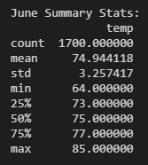
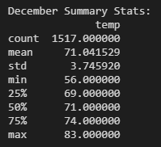

# Surf's Up Temperature EDA
## Overview
The purpose of this analysis is to take weather data from several years at a potential business site in Oahu, and produce some simple summary statistics using pandas and queries to a SQLite database.

## Results

* The weather in June is slightly warmer than December, by an avg. of ~4 degrees
* December's weather is less consistent (has higher variance)
* Three-quarters of the measured December temperatures were 69 degrees or higher (25th percentile+)
* Highs in June and December are fairly similar, at 85 and 83 respectively
* Median temps are 71 and 75 for June and December respectively

## Summary
This quick analysis shows that December in Oahu is slightly cooler than June, but not by a huge margin.

The prompt of this exercise was to determine whether the weather was conistent enough to advise opening a year-round surf shop at the measured location. Assuming that the June weather is our baseline "good surfing weather", the slight difference in temperature alone does not suggest that December would be "bad surfing weather". We'll likely need to do some market research about what the cutoff is for good/bad surfing weather to determine this.

Temperature is not the only factor in determining surfing weather - it is likely that precipitation would have a much larger impact on expected revenue for a surf shop.

With the available data, we could perform the following additional queries to retrieve more information:
1. How does precipitation vary between June and December?
2. If we define an amount of precipitation to classify a "rainy day", can we identify seasonal differences in how long bad weather persists? For example, do storms usually last shorter in the Summer? If we get one rainy day in December, would we expect three more?
3. Similar to #2, we might assume that streaks of hot temperatures would lead to more revenue for the surf shop. What are the seasonal differences in expected "hot streak" length? 
